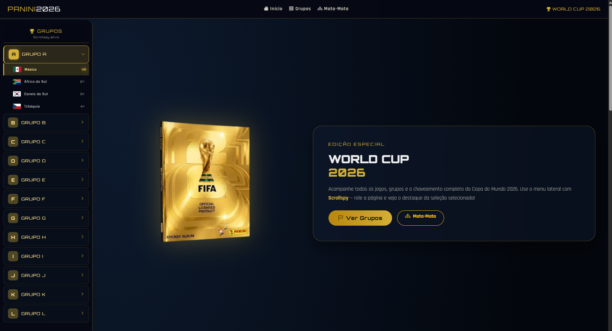
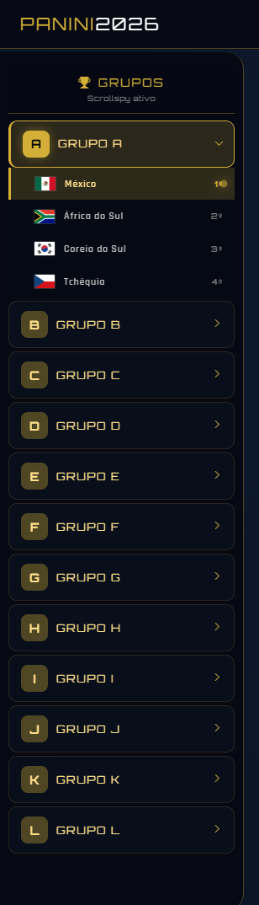
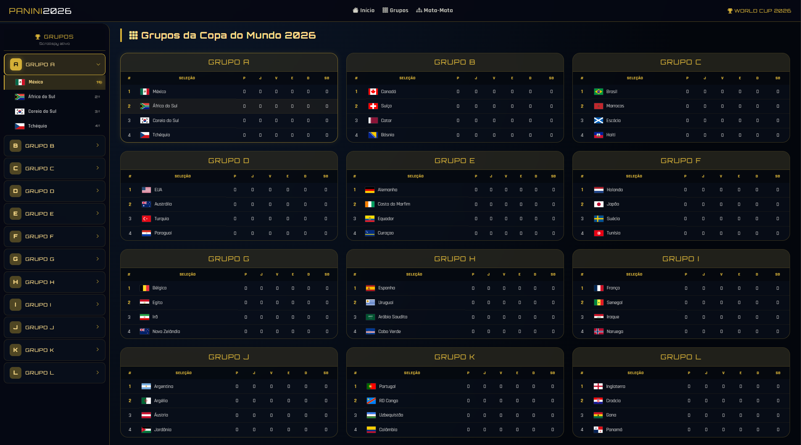
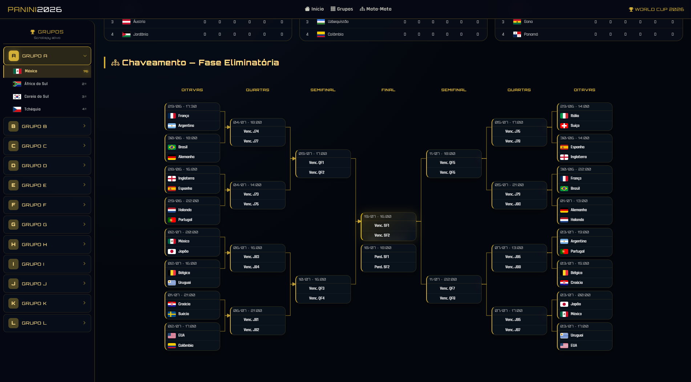

# PANINI World Cup 2026 — Tabela Oficial e Chaveamento


Site oficial da tabela da Copa do Mundo 2026 da **PANINI**, desenvolvido com HTML5, CSS3 e Bootstrap 5.3. Apresenta os 12 grupos da competição, classificação das 48 seleções, chaveamento completo da fase eliminatória e um sistema de navegação com **Scrollspy** que destaca automaticamente a seleção visível durante a rolagem.

---

## Screenshots

### Visão geral da página inicial


### Sidebar


### Grupos


### Chaveamento


---

## Funcionalidades

- **12 grupos (A a L)** com tabelas completas: posição, pontos, jogos, vitórias, empates, derrotas e saldo de gols
- **48 seleções** com bandeiras oficiais carregadas do flagcdn.com
- **Chaveamento completo** da fase eliminatória: oitavas, quartas, semifinal, final e decisão de 3º lugar
- **Conexões SVG** entre as partidas com setas douradas e caminhos ortogonais
- **Scrollspy integrado** ao menu lateral com acordeão — destaque automático da seleção visível
- **Design glassmorphism** com paleta dourada inspirada na identidade PANINI
- **Totalmente responsivo** — desktop, tablet e mobile
- **Menu mobile** com botão flutuante e sidebar colapsável
- **Animações CSS** — álbum flutuante, cards com hover, bolinha pulsante no Scrollspy

---

## Tecnologias Utilizadas

| Tecnologia | Descrição |
|------------|-----------|
| **HTML5** | Estrutura semântica das seções |
| **CSS3** | Variáveis customizadas, grid, glassmorphism, animações keyframe |
| **Bootstrap 5.3** | Sistema de grid, navbar responsiva, Scrollspy, utilitários |
| **JavaScript ES6** | Acordeão, MutationObserver, renderização dinâmica do chaveamento com SVG |
| **Bootstrap Icons** | Ícones vetoriais no cabeçalho, sidebar e botões |
| **flagcdn.com** | Bandeiras nacionais em PNG com suporte a redimensionamento |
| **Google Fonts** | Orbitron (títulos) e Rajdhani (corpo) |

---

## Design

### Paleta de Cores
| Cor | Código | Uso |
|-----|--------|-----|
| Dourado PANINI | `#d4af37` | Detalhes, bordas, destaques |
| Dourado Claro | `#ffdf8c` | Textos ativos, ícones |
| Azul Escuro | `#03060c` | Fundo principal |
| Azul Médio | `#0a0f1e` | Cards e sidebar |
| Vidro | `rgba(15,25,45,0.5)` | Efeito glassmorphism |

### Efeitos
- **Glassmorphism**: `backdrop-filter: blur()` + fundos semi-transparentes
- **Álbum Flutuante**: animação CSS 3D com `rotateY` e `rotateX`
- **Cards Hover**: bordas douradas que se intensificam + sombra
- **Scrollspy Ativo**: bolinha pulsante dourada no menu lateral

---

## Responsividade

| Breakpoint | Layout |
|------------|--------|
| **≥ 1200px** | Grid de grupos com 3 colunas, sidebar visível |
| **992px — 1199px** | Grid com 2 colunas, sidebar visível |
| **768px — 991px** | Grid com 1 coluna, sidebar oculta (menu mobile) |
| **< 768px** | Grid com 1 coluna, cards e chaveamento com scroll horizontal |

---

## Como Executar

1. Clone o repositório:
   ```bash
   git clone https://github.com/FaculdadeJV/World_Cup.git


  ## Autor
- Jonathan Arsego Lêla
- RA: 22408629
- Engenharia da Computação - CEUB


